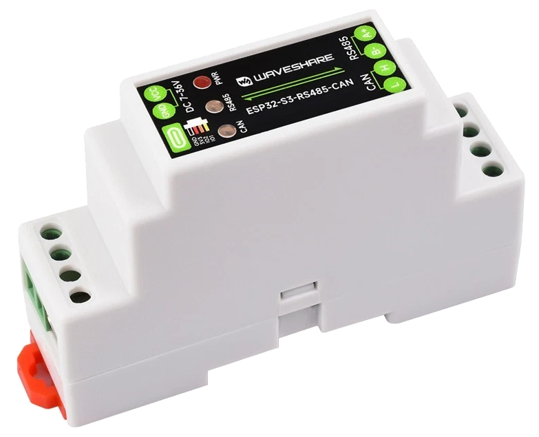
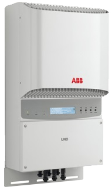
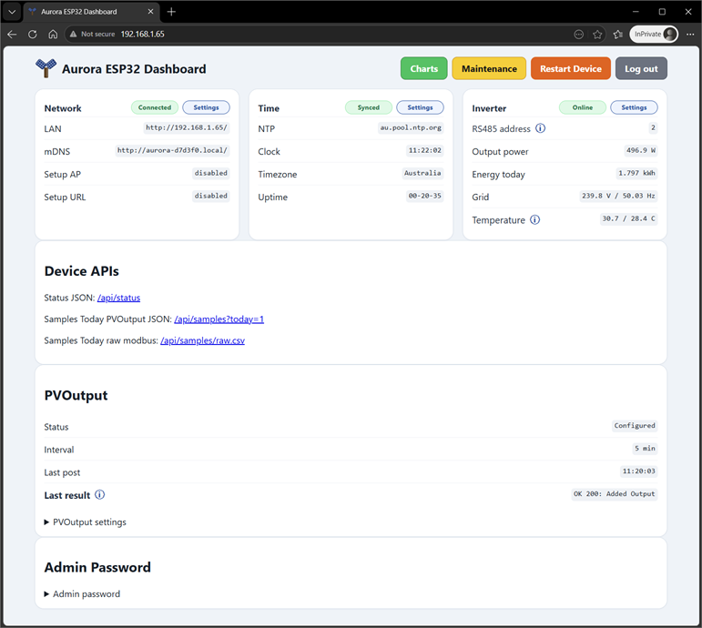
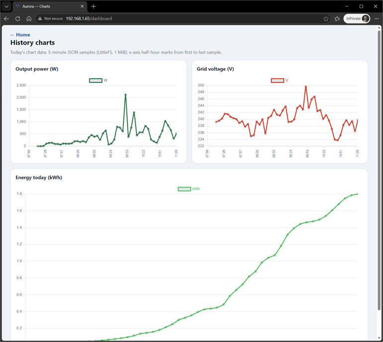
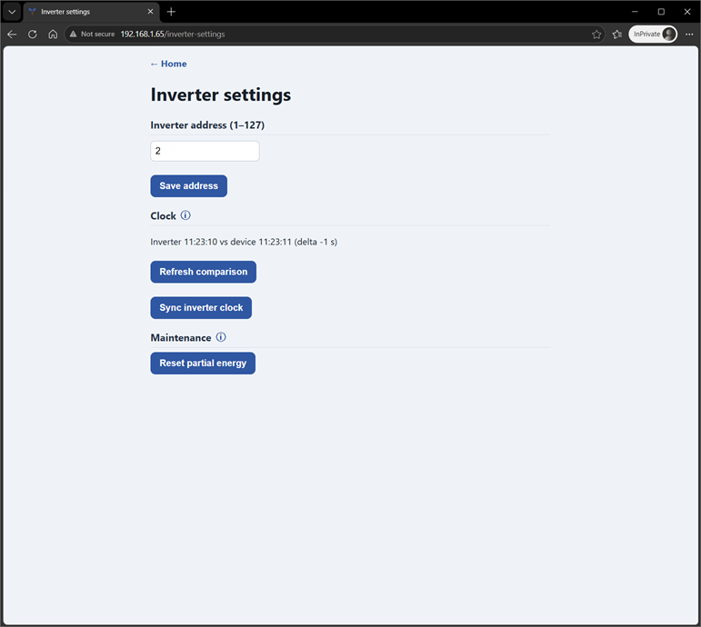
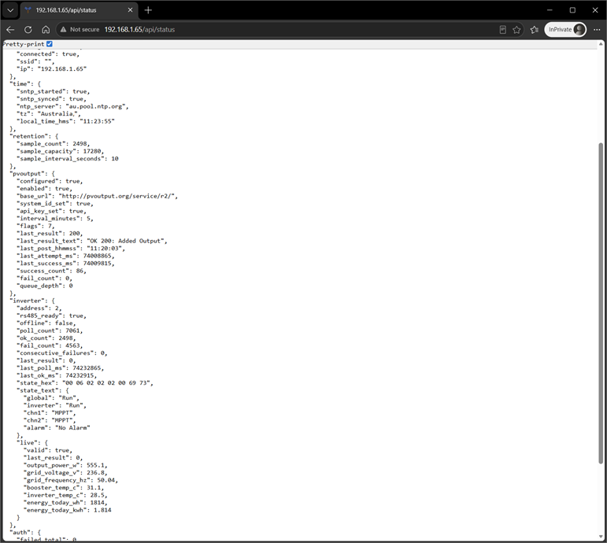

# Aurora ESP32 Dashboard

ESP-IDF firmware for a **local web dashboard** that polls **Aurora / Power-One class solar inverters** over **RS-485**, shows live metrics and charts on your LAN, and can upload readings to **[PVOutput](https://pvoutput.org/)**.

Firmware version **0.3.0** (see `CMakeLists.txt` / `main/app_main.c`).

## Target hardware

This project is built and tested on the **Waveshare [ESP32-S3-RS485-CAN](https://www.waveshare.com/esp32-s3-rs485-can.htm)** board (ESP32-S3 with onboard **RS-485** transceiver, terminal-block power input, and USB for flash/debug).

<p align="center">
  
</p>

| Item | Detail |
|------|--------|
| MCU | ESP32-S3 (dual-core, typically with **8 MB PSRAM** on Waveshare modules) |
| Flash | **16 MB** (partition table assumes 16 MB; adjust `partitions.csv` if your module differs) |
| RS-485 | UART to inverter **A/B** terminals (default **19200 8N1**, address **2** — configurable in the web UI) |
| RTC (optional) | **PCF85063** on I2C when populated on your build |
| Power | **7–36 V** on the screw terminals; avoid feeding USB and terminal supply at the same time |

Wiring and bring-up notes: [`docs/HARDWARE.md`](docs/HARDWARE.md).

**Inverter:** Aurora / Power-One family (and compatible clones) with an RS-485 port labelled per the inverter manual (+T/R, −T/R, RTN, etc.).

<p align="center">
  
</p>

## What it does

- **Provisioning:** Open Wi‑Fi AP `aurora-XXXXXX` and setup page at `http://192.168.4.1/` until Wi‑Fi is saved.
- **Web UI:** Session-based login, dashboard with Chart.js, network/time/inverter/maintenance pages.
- **Polling:** ~10 s RS-485 reads; RAM ring buffer plus optional **LittleFS** `daylog` partition for ~2 days of samples.
- **PVOutput:** System ID, API key, and interval configured in the UI (stored in **NVS** on the device only — not in this repo).
- **Maintenance:** CPU frequency, in-RAM log export, **factory reset** (erases NVS + data partitions), device restart.

Feature list and API summary: [`FEATURES.md`](FEATURES.md).

## Repository contents

| Path | Purpose |
|------|---------|
| `main/` | Application (`app_main.c`), daylog, RTC, embedded assets |
| `partitions.csv` | NVS, PHY, factory app, daylog, coredump |
| `sdkconfig.defaults` | Suggested Kconfig defaults (PSRAM, flash size, etc.) |
| `docs/` | Hardware notes |
| `dependencies.lock` | Pinned Component Manager versions (`mdns`, `littlefs`) |

**Not included:** build output, personal `sdkconfig`, Wi‑Fi credentials, PVOutput keys, or inverter settings — those live in device **NVS** after you configure the unit.

Default sign-in after flash or factory reset: username **`Admin`**, password **`Password`** (change via the dashboard).

<p align="center">
  
</p>

<p align="center">
  
</p>

<p align="center">
  
</p>

<p align="center">
  
</p>

## Requirements

- **[ESP-IDF](https://docs.espressif.com/projects/esp-idf/)** v5.x or **v6.x** (developed with **6.0**)
- USB cable to the Waveshare board (USB-Serial/JTAG)
- Windows, Linux, or macOS

## Build and flash (Windows PowerShell)

```powershell
# Install ESP-IDF once, then each session:
. "C:\esp\v6.0.1\esp-idf\export.ps1"   # adjust path to your IDF install

Set-Location "C:\path\to\Aurora-ESP32-Dashboard"

idf.py set-target esp32s3
idf.py build
idf.py -p COM4 flash monitor    # replace COM4 with your port
```

Exit the serial monitor with **Ctrl + ]**.

First-time clone: Component Manager dependencies download on the first `idf.py build` (`managed_components/` is gitignored).

Optional full chip erase before reflash:

```powershell
idf.py -p COM4 erase-flash
idf.py -p COM4 flash
```

## First use

1. Flash firmware and power the board (terminal supply or USB per Waveshare guidance).
2. Join the open Wi‑Fi **`aurora-XXXXXX`** (suffix from MAC).
3. Open **`http://192.168.4.1/`**, sign in with **Admin** / **Password**, save your home Wi‑Fi.
4. After STA connects, use the LAN IP or **`http://aurora-XXXXXX.local/`** (mDNS).
5. Set inverter RS-485 address, timezone, and optional PVOutput credentials in the UI.

## Factory reset

**Maintenance → Factory reset** clears NVS (Wi‑Fi, passwords, PVOutput, etc.), the daylog partition, and related data, then reboots. Expect **two reboots**; afterward the device returns to provisioning mode with factory login defaults.

## Security

- Intended for a **trusted home LAN**; the device serves **HTTP** only (no TLS on-chip).
- Do not commit `sdkconfig` or any file containing your Wi‑Fi SSID, PVOutput API key, or custom passwords.
- Change the default admin password after setup.

## License

See [LICENSE](LICENSE) in this repository.

## Related documentation

- [`FEATURES.md`](FEATURES.md) — current behaviour and HTTP API
- [`docs/HARDWARE.md`](docs/HARDWARE.md) — RS-485 wiring
